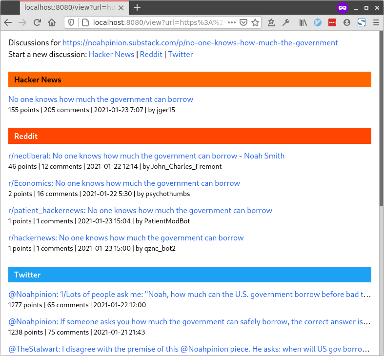

# Hallway

> If it looks like a hallway, feels like a hallway, and acts like a hallway—is
> it important to figure out that it isn’t a hallway?
>
> — Patricia Briggs

Hallway is a web app that helps you find relevant discussions. Enter a URL and
it will load discussions for that URL from Hacker News, Reddit and Twitter.
I've deployed it to [discuss.findka.com](https://discuss.findka.com). You can
enter a URL on the home page, or you can set it via query parameter:

```
https://discuss.findka.com/view?url={some url}
```

I made Hallway so that I could add "discuss this essay" links to
[Findka](https://essays.findka.com) without expanding its scope too much. (If
anyone asks for a feature, I can just say "happy to accept a PR"). I've written
it with Clojure and [Biff](https://findka.com/biff), though only a few of
Biff's features are necessary for this simple app (so far).



## Contributing

Please do.

## License

Distributed under the [EPL v2.0](LICENSE)

Copyright &copy; 2020 [Jacob O'Bryant](https://jacobobryant.com).
